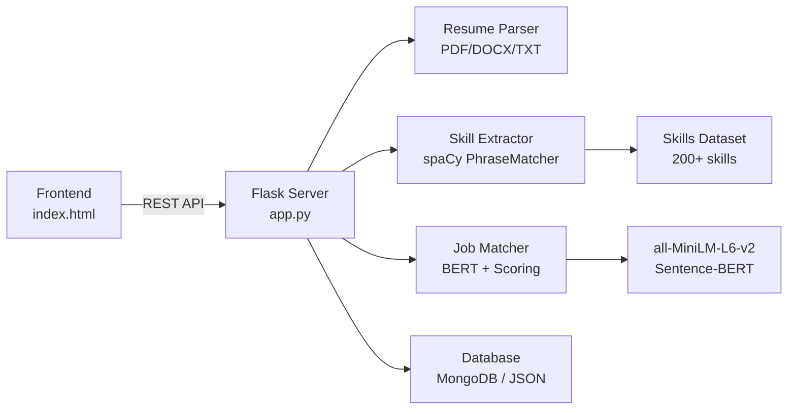

# 🔬 AI Resume Analyzer — Full Project Analysis

## Project Overview

An **AI-powered ATS (Applicant Tracking System)** that parses resumes (PDF/DOCX/TXT), extracts skills using NLP, and scores candidates against job descriptions using keyword matching + deep learning–based semantic similarity.

---

## 🧠 ML / DL / NLP Concepts Used

### NLP (Natural Language Processing)

| Concept | Where Used | Implementation |
|---------|-----------|----------------|
| **Tokenization** | [skill_extractor.py](file:///c:/Users/HENIL/OneDrive/Desktop/ai%20project/backend/services/skill_extractor.py) | spaCy's `en_core_web_sm` model tokenizes resume text into linguistic tokens |
| **Phrase Matching** | [skill_extractor.py](file:///c:/Users/HENIL/OneDrive/Desktop/ai%20project/backend/services/skill_extractor.py#L26-L29) | spaCy `PhraseMatcher` with `attr="LOWER"` matches 200+ skills from a curated dataset |
| **Text Preprocessing** | [resume_parser.py](file:///c:/Users/HENIL/OneDrive/Desktop/ai%20project/backend/services/resume_parser.py#L52-L59) | Lowercasing, regex cleaning, whitespace normalization |
| **Named Entity–style Extraction** | [resume_parser.py](file:///c:/Users/HENIL/OneDrive/Desktop/ai%20project/backend/services/resume_parser.py#L62-L87) | Regex-based extraction of emails, phone numbers, names |
| **Pattern-based Info Extraction** | [skill_extractor.py](file:///c:/Users/HENIL/OneDrive/Desktop/ai%20project/backend/services/skill_extractor.py#L61-L79) | Regex patterns extract years of experience (e.g., "5+ years of experience") |
| **Keyword-based Classification** | [skill_extractor.py](file:///c:/Users/HENIL/OneDrive/Desktop/ai%20project/backend/services/skill_extractor.py#L82-L93) | Education level detection via keyword matching (PhD, Masters, Bachelors, etc.) |

### Deep Learning (DL)

| Concept | Where Used | Implementation |
|---------|-----------|----------------|
| **Sentence Embeddings (BERT)** | [job_matcher.py](file:///c:/Users/HENIL/OneDrive/Desktop/ai%20project/backend/services/job_matcher.py#L31-L45) | `sentence-transformers` library with `all-MiniLM-L6-v2` model encodes resume and job description into dense vectors |
| **Cosine Similarity** | [job_matcher.py](file:///c:/Users/HENIL/OneDrive/Desktop/ai%20project/backend/services/job_matcher.py#L41) | `pytorch_cos_sim` computes semantic similarity between resume and job description embeddings |
| **Transfer Learning** | Implicit | Uses a **pre-trained** MiniLM transformer model (distilled from BERT) — no custom training needed |

### Machine Learning (ML)

| Concept | Where Used | Implementation |
|---------|-----------|----------------|
| **Weighted Scoring Model** | [job_matcher.py](file:///c:/Users/HENIL/OneDrive/Desktop/ai%20project/backend/services/job_matcher.py#L48-L69) | 60% keyword match + 30% semantic match + 10% experience = final score |
| **Set-based Matching** | [job_matcher.py](file:///c:/Users/HENIL/OneDrive/Desktop/ai%20project/backend/services/job_matcher.py#L1-L28) | Intersection/difference of skill sets to compute matched vs missing skills |
| **Threshold-based Classification** | [job_matcher.py](file:///c:/Users/HENIL/OneDrive/Desktop/ai%20project/backend/services/job_matcher.py#L72-L85) | Score → label mapping: Strong (80+), Good (60-79), Partial (40-59), Weak (<40) |

---

## 📊 Work Completed — File-by-File Breakdown

| File | Lines | Status | Purpose |
|------|-------|--------|---------|
| [app.py](file:///c:/Users/HENIL/OneDrive/Desktop/ai%20project/backend/app.py) | 188 | ✅ Done | Flask API — 7 endpoints (health, analyze, CRUD candidates, stats, clear) |
| [resume_parser.py](file:///c:/Users/HENIL/OneDrive/Desktop/ai%20project/backend/services/resume_parser.py) | 102 | ✅ Done | PDF/DOCX/TXT extraction + text cleaning + contact info extraction |
| [skill_extractor.py](file:///c:/Users/HENIL/OneDrive/Desktop/ai%20project/backend/services/skill_extractor.py) | 94 | ✅ Done | spaCy PhraseMatcher + experience/education extraction |
| [job_matcher.py](file:///c:/Users/HENIL/OneDrive/Desktop/ai%20project/backend/services/job_matcher.py) | 86 | ✅ Done | Scoring engine (keyword + BERT semantic + experience) |
| [db_handler.py](file:///c:/Users/HENIL/OneDrive/Desktop/ai%20project/backend/database/db_handler.py) | 141 | ✅ Done | MongoDB + JSON fallback (CRUD + stats) |
| [index.html](file:///c:/Users/HENIL/OneDrive/Desktop/ai%20project/frontend/index.html) | ~1800+ | ✅ Done | Full frontend — upload, results view, candidates list, dashboard |
| [skills_dataset.json](file:///c:/Users/HENIL/OneDrive/Desktop/ai%20project/data/skills/skills_dataset.json) | 64 | ✅ Done | 200+ skills across 12 categories |
| [Dockerfile](file:///c:/Users/HENIL/OneDrive/Desktop/ai%20project/deployment/Dockerfile) | 17 | ✅ Done | Production Docker image with gunicorn |
| [requirements.txt](file:///c:/Users/HENIL/OneDrive/Desktop/ai%20project/backend/requirements.txt) | 12 | ✅ Done | All Python dependencies pinned |
| [setup.sh](file:///c:/Users/HENIL/OneDrive/Desktop/ai%20project/setup.sh) | ~60 | ✅ Done | One-command setup script |
| [README.md](file:///c:/Users/HENIL/OneDrive/Desktop/ai%20project/README.md) | 145 | ✅ Done | Full documentation with API reference |

**Total: ~2,700+ lines of code across 11 files**

### ✅ What's Fully Working

- Resume upload & text extraction (PDF, DOCX, TXT)
- NLP skill detection using spaCy PhraseMatcher (200+ skills, 12 categories)
- Semantic scoring with Sentence-BERT (`all-MiniLM-L6-v2`)
- Weighted composite scoring (keyword 60% + semantic 30% + experience 10%)
- Full REST API (7 endpoints)
- Candidate management (save, list, view, delete)
- Dashboard analytics (score distribution, top skills)
- MongoDB Atlas support + local JSON fallback
- Docker deployment ready
- Frontend with multi-page SPA (analyze, candidates, dashboard)

---

## 🚀 What to Do Next to Go LIVE

### 🔴 Critical (Must-Have Before Launch)

| # | Task | Why It's Needed |
|---|------|-----------------|
| 1 | **Add Authentication & Authorization** | Prevent unauthorized access; add login/signup for recruiters (use JWT or session-based auth) |
| 2 | **Input Validation & Sanitization** | Prevent XSS, injection attacks — validate file size limits, form inputs, sanitize all user data |
| 3 | **Rate Limiting** | Add `flask-limiter` to prevent abuse of the `/analyze` endpoint (BERT inference is expensive) |
| 4 | **HTTPS / SSL** | Mandatory for production — use a reverse proxy (Nginx) with SSL certificates |
| 5 | **Environment-based Config** | Separate dev/staging/production configs; never expose debug mode in production (`debug=False`) |
| 6 | **Error Handling & Logging** | Replace `print()` with proper logging (`logging` module); add structured error responses |

### 🟡 Important (Should-Have for Production Quality)

| # | Task | Details |
|---|------|---------|
| 7 | **Unit & Integration Tests** | No tests exist currently — add `pytest` tests for parser, extractor, matcher, and API endpoints |
| 8 | **File Size Limits** | Cap uploads (e.g., 10MB) to prevent server overload |
| 9 | **BERT Model Caching** | Currently loads the Sentence-BERT model on **every request** (`SentenceTransformer('all-MiniLM-L6-v2')` inside function). **Cache it as a global** or singleton |
| 10 | **CORS Restrictions** | Currently `CORS(app)` allows all origins — restrict to your frontend domain |
| 11 | **Multi-Resume Bulk Upload** | Listed in roadmap; recruiters need this for batch processing |
| 12 | **Host the Frontend** | Currently a local HTML file — deploy to **Vercel**, **Netlify**, or serve via Flask |
| 13 | **CI/CD Pipeline** | Add GitHub Actions for automated testing + Docker build + deploy to AWS/GCP/Railway |

### 🟢 Nice-to-Have (Enhancements)

| # | Task | Details |
|---|------|---------|
| 14 | **Resume Improvement Suggestions** | Use the missing skills data to suggest improvements to candidates |
| 15 | **Export to CSV/Excel** | Add candidate export functionality |
| 16 | **AI Chatbot for HR Queries** | As listed in your roadmap — could use an LLM to answer questions about candidate pool |
| 17 | **Multi-language Resume Support** | Currently English-only; add spaCy models for other languages |
| 18 | **Real NER for Name Extraction** | Current name extraction is heuristic-based — use spaCy NER (`PERSON` entity) for better accuracy |

---

## 📌 Architecture Summary

> [!IMPORTANT]
> The **most critical performance issue** is in [job_matcher.py:L38](file:///c:/Users/HENIL/OneDrive/Desktop/ai%20project/backend/services/job_matcher.py#L38) — the Sentence-BERT model is loaded fresh on every `/analyze` request. This should be loaded once at startup and cached globally.

> [!TIP]
> For the quickest path to going live, consider deploying on **Railway** or **Render** (free tier) instead of setting up AWS EC2. They support Docker and auto-deploy from GitHub.
